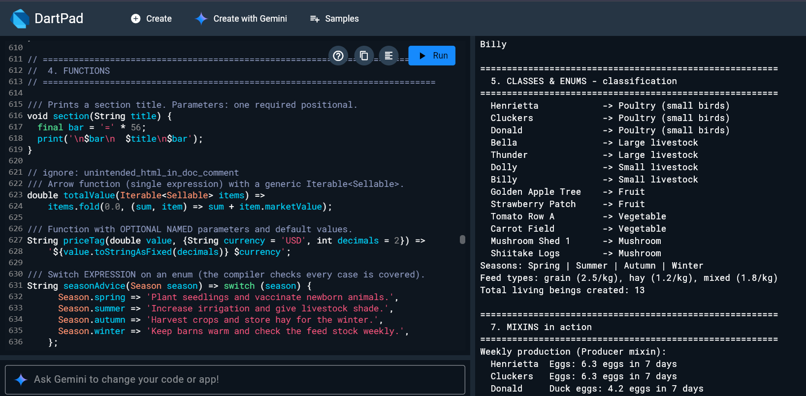
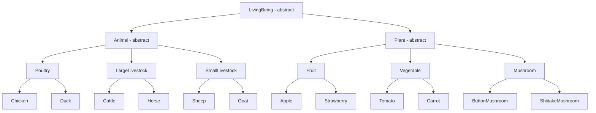

# 🌾 Big Farm Management System

A single-file **Dart** practice project that models a large farm. It is designed to run on [DartPad](https://dartpad.dev) and reinforces the core building blocks of the language through one realistic, connected example.

---

## 📌 Overview

The program manages a farm containing **living beings**, split into **animals** and **plants**. It simulates feeding, veterinary checks, harvesting, production, and market valuation, and uses every major Dart concept along the way.

---

## ▶️ How to Run

1. Open [dartpad.dev](https://dartpad.dev).
2. Delete the default code.
3. Paste the contents of `farm_management.dart`.
4. Click **Run**. The output appears in the console panel, split into labeled sections.

> No external packages are required. Only `dart:async` and `dart:math` are imported.

---

## 🧬 Class Hierarchy

### Animals

| Category | Class | Product | Notes |
|---|---|---|---|
| Poultry | `Chicken` | Eggs | Eats grain |
| Poultry | `Duck` | Duck eggs | Overrides `canFly` |
| Large livestock | `Cattle` | Milk | Eats hay, 2.5% of body weight daily |
| Large livestock | `Horse` | None | No `Producer` mixin |
| Small livestock | `Sheep` | Wool | Eats mixed feed |
| Small livestock | `Goat` | Goat milk | Eats mixed feed |

### Plants

| Category | Class | Growth (days) | Mixins | Notes |
|---|---|---|---|---|
| Fruit | `Apple` | 180 | Harvestable, Irrigable | Perennial |
| Fruit | `Strawberry` | 60 | Harvestable, Irrigable | Not perennial |
| Vegetable | `Tomato` | 90 | Harvestable, Irrigable | |
| Vegetable | `Carrot` | 75 | Harvestable, Irrigable | Root vegetable |
| Mushroom | `ButtonMushroom` | 21 | Harvestable | Grows on compost |
| Mushroom | `ShiitakeMushroom` | 60 | Harvestable | Grows on oak logs, premium price |

---

## 📚 Dart Concepts Covered

| Concept | Where to find it in the code |
|---|---|
| **Hello World** | Start of `main()` |
| **Variables** | `const`, `final`, `var`, `late`, nullable `String?` in section 2 |
| **Control flow** | `if / else if / else`, `for-in`, `while`, `continue`, switch expressions, collection-if / collection-for |
| **Functions** | `section()`, `totalValue()`, `priceTag()` with named and default parameters, closures, `typedef PriceRule` |
| **Comments** | `//`, `/* */`, and `///` documentation comments |
| **Imports** | `dart:async`, `dart:math` |
| **Classes** | `Farm`, `LivingBeing` and its subclasses, `factory Farm.sample()`, static counter |
| **Enums** | `Season`, `FeedType` (enhanced enums with fields), `HealthStatus` |
| **Inheritance** | Three-level hierarchies such as `LivingBeing → Animal → Poultry → Chicken` |
| **Mixins** | `Feedable`, `Producer`, `Harvestable` and `Irrigable` (both restricted with `on Plant`) |
| **Interfaces and abstract classes** | `Sellable` and `Reportable` (`abstract interface class`), abstract `LivingBeing`, `Animal`, `Plant` |
| **Async** | `Future`, `Future.delayed`, `Future.wait`, `async / await`, `Stream` with `async*` / `yield`, `await for` |
| **Exceptions** | Custom exceptions, `try / on / catch / finally`, stack traces, null-safe lookups |
| **Important concepts** | Null safety (`?`, `??`, `!`, `?.`), generics, extension methods, records, pattern matching, cascade operator (`..`) |

---

## 🔍 Program Flow

| Section | What happens |
|---|---|
| **1 · Hello World** | Prints the welcome message |
| **2 · Variables** | Declares farm data and creates the sample farm |
| **3 · Control flow** | Census, season advice, barn sounds, a 3-day feeding loop that triggers a feed shortage and restock |
| **5 · Classes and Enums** | Classifies every living being, prints enum values |
| **7 · Mixins** | Weekly production, irrigation plans, daily feed cost |
| **6 · Interfaces** | Builds a `Sellable` catalog, sorts it by value, applies a discount closure |
| **9 · Async** | Runs vet check and soil analysis in parallel, harvests crops, streams 3 daily reports |
| **10 · Exceptions** | Demonstrates duplicate registration, early harvest, `StateError`, and missing lookups |
| **13 · Recap** | Records, destructuring, cascade, null-aware access, higher-order functions |

---

## 🧠 Design Notes

- **Mixins over deep inheritance.** Egg, milk, and wool production are modeled with one `Producer` mixin instead of separate subclasses. A `Horse` simply does not use it.
- **`on` clause.** `Harvestable` and `Irrigable` are restricted to `Plant`, so they can safely use members like `name` and `daysPlanted`.
- **Interfaces across hierarchies.** Animals and plants are unrelated branches, yet both implement `Sellable`, so they can share one `List<Sellable>`.
- **Custom exception hierarchy.** `FarmException` is the base type, with `InsufficientFeedException` and `NotReadyForHarvestException` as specific cases.
- **Fixed random seed.** `Random(7)` keeps the vet check results identical on every run.

---

## 🧪 Practice Ideas

1. Add a new category, for example `Beehive` under small livestock with honey as a `Producer`.
2. Add a `Vaccinable` mixin and apply it only to some animals.
3. Create a `sealed class` for farm events and handle them with an exhaustive `switch`.
4. Replace the fixed feed stock with a `Stream` of delivery trucks arriving over time.
5. Add a method that finds the most profitable animal using `fold` or `reduce`.
6. Throw and catch an exception inside a `Future` using `.catchError()` and compare it with `try / catch`.

---

## 📁 Files

| File | Description |
|---|---|
| `farm_management.dart` | The complete runnable program |
| `Farm_Management.md` | This documentation |