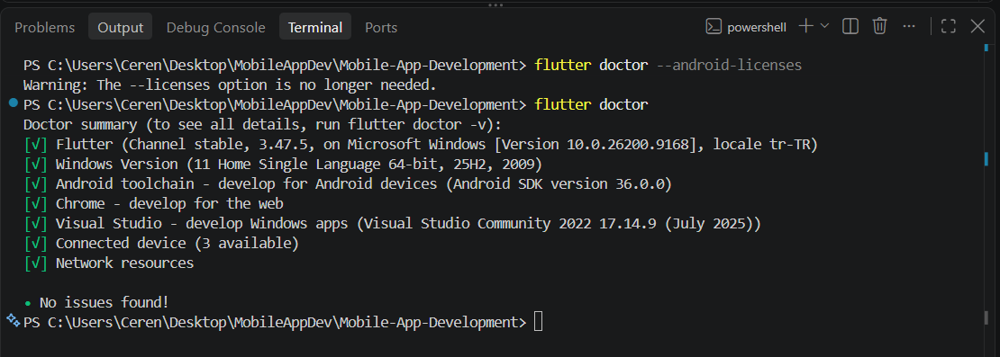

# Flutter and Dart Installation Steps

The installation of the Flutter SDK and all necessary dependencies to set up the mobile app development environment has been successfully completed. (Note: The Dart language comes built-in with the Flutter SDK).

## Steps Completed
1. **Flutter SDK Configuration:** The latest Flutter version was downloaded and extracted to the `C:\src\flutter` directory.
2. **Path Settings:** The `C:\src\flutter\bin` path was added to the Path variable in the System Environment Variables so that the terminal and editors can recognize the commands.
3. **Android Development Environment:** Android Studio was installed, and the `Android SDK Command-line Tools` package was enabled via the SDK Manager.
4. **License Agreements:** The `flutter doctor --android-licenses` command was executed to accept the required Google license agreements.
5. **Verification:** A system scan was performed using the `flutter doctor` tool, confirming that the Android toolchain, Windows infrastructure, and VS Code integration are working seamlessly (with green checkmarks).

## Installation Verification Screenshot
