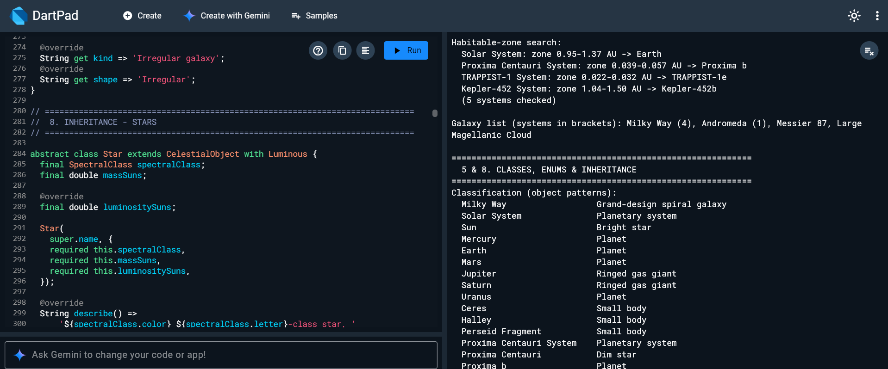
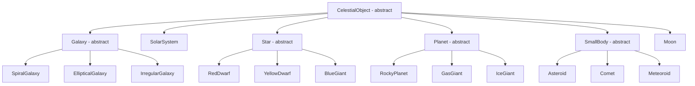

# 🪐 Universe Observer System

A single-file **Dart** practice project that models the universe and an observatory that studies it. It is designed to run on [DartPad](https://dartpad.dev) and reinforces the core building blocks of the language through one connected example.

---

## 📌 Overview

The program builds a small **universe** made of galaxies, planetary systems, stars, planets, moons, and small bodies. An **observatory** with different telescopes then points at these objects, collects light asynchronously, and runs into realistic problems such as targets that are too far away or instruments that are not installed. Along the way it uses every major Dart concept.

> All astronomical values are rounded or illustrative. The "Andromeda Alpha" system is fictional.

---

## ▶️ How to Run

1. Open [dartpad.dev](https://dartpad.dev).
2. Delete the default code.
3. Paste the contents of `universe_observer.dart`.
4. Click **Run**. The output appears in the console panel, split into labeled sections.

> No external packages are required. Only `dart:async` and `dart:math` are imported.

---

## 🧬 Class Hierarchy

**Containment (composition):** `Universe → Galaxy → SolarSystem → Star + Planets / SmallBodies → Moons`

Inheritance answers *"what kind of object is it?"*, while containment answers *"what does it contain?"*.

### Galaxies and Systems

| Category | Class | Notes |
|---|---|---|
| Galaxy | `SpiralGalaxy` | Has an `armCount`; used for the Milky Way and Andromeda |
| Galaxy | `EllipticalGalaxy` | Used for Messier 87 |
| Galaxy | `IrregularGalaxy` | Used for the Large Magellanic Cloud |
| System | `SolarSystem` | Holds one `Star` and a list of orbiting bodies; computes the habitable zone |

### Stars

| Class | Spectral class | Mixins | Notes |
|---|---|---|---|
| `RedDwarf` | M | Luminous | Proxima Centauri, TRAPPIST-1 |
| `YellowDwarf` | G | Luminous | The Sun, Kepler-452 |
| `BlueGiant` | O | Luminous | Alpha-X (fictional) |

### Planets, Moons and Small Bodies

| Category | Class | Mixins | Notes |
|---|---|---|---|
| Planet | `RockyPlanet` | Orbiting, Rotating, MoonBearer | Has `hasAtmosphere` |
| Planet | `GasGiant` | Orbiting, Rotating, MoonBearer | Has `hasRings` |
| Planet | `IceGiant` | Orbiting, Rotating, MoonBearer | Uranus |
| Natural satellite | `Moon` | Orbiting | Orbits a planet, not a star |
| Small body | `Asteroid` | Orbiting | Ceres |
| Small body | `Comet` | Orbiting | Halley, has `eccentricity` |
| Small body | `Meteoroid` | Orbiting | Burns up as a meteor if smaller than 10 m |

---

## 📚 Dart Concepts Covered

| Concept | Where to find it in the code |
|---|---|
| **Hello World** | Start of `main()` |
| **Variables** | `const`, `final`, `var`, `late`, nullable `String?` in section 2 |
| **Control flow** | `if / else if / else`, `switch` statement, `for-in`, `while`, `do-while`, `break`, `continue`, switch expressions, collection-if / collection-for |
| **Functions** | `section()`, `bar([width])` with an optional positional parameter, `describeDistance()` with named and default parameters, `select()` as a higher-order function, closures, `typedef ObjectFilter` |
| **Comments** | `//`, `/* */`, and `///` documentation comments |
| **Imports** | `dart:async` (`Completer`, `Timer`, `TimeoutException`), `dart:math` (`sqrt`, `pow`) |
| **Classes** | `Universe`, `Observatory`, `Watchlist<T>`, `CelestialObject` and its subclasses, `factory Universe.sample()`, static counter `_counter` |
| **Enums** | `ObservationMethod` and `SpectralClass` (enhanced enums with fields, constructors, and a static method) |
| **Inheritance** | Three-level hierarchies such as `CelestialObject → Planet → RockyPlanet`, constructor forwarding with `super.name` |
| **Mixins** | `Luminous`, `Orbiting`, `Rotating`, `MoonBearer` (a mixin that holds state) |
| **Interfaces and abstract classes** | `Observable` and `Catalogable` (`abstract interface class`), abstract `CelestialObject`, `Galaxy`, `Star`, `Planet`, `SmallBody` |
| **Async** | `Future`, `Future.delayed`, `Future.wait`, `Completer` + `Timer`, `async / await`, `Stream` with `async*` / `yield`, `await for` |
| **Exceptions** | Custom exception hierarchy, `try / on / catch / finally`, `rethrow`, stack traces, `.timeout()`, null-safe lookups |
| **Important concepts** | Null safety (`?`, `??`, `??=`, `?.`), generics with bounded types, extension methods, records and destructuring, pattern matching, generators (`sync*`, `yield*`), cascade operator (`..`), spread operator (`...`) |

---

## 🔍 Program Flow

| Section | What happens |
|---|---|
| **1 · Hello World** | Prints the welcome message |
| **2 · Variables** | Declares observatory data, builds the sample universe, creates the `Observatory` with a `Set` of instruments |
| **3 · Control flow** | Census with a record, galaxy distance categories, first ringed gas giant (`break`), habitable-zone search (`while` + `continue`), collection-if / collection-for |
| **5 & 8 · Classes, Enums and Inheritance** | Classifies every object with object patterns, prints spectral classes, shows the first catalog entries |
| **7 · Mixins** | Star brightness, planet orbits and day lengths, moon orbits, small bodies |
| **6 · Interfaces** | Puts unrelated objects in one `List<Observable>`, sorts them by distance, filters with a `typedef`'d closure |
| **9 · Async** | Countdown (`do-while`), calibration with `Completer`, single observation, four parallel observations with `Future.wait`, sky survey with a `Stream` |
| **10 · Exceptions** | Out of range target, missing instrument, unknown object, timeout, `rethrow` + `finally`, null-safe lookup |
| **13 · Recap** | Records, destructuring, generics (`Watchlist<Star>`), `Map.update`, cascade, null-aware assignment, spread |

---

## 🔭 Observation Methods

Each instrument has a maximum range. Observing anything farther throws a `TargetOutOfRangeException`.

| Method | Max range | Installed at *Deep Sky Station* |
|---|---|---|
| Optical telescope | 3 million ly | ✅ |
| Infrared telescope | 60 million ly | ✅ |
| X-ray telescope | 1 million ly | ❌ |
| Radio telescope | 10 billion ly | ✅ |

For example, Messier 87 (53.5 million ly) is too far for the optical telescope, and any observation with the X-ray telescope fails because it is not installed.

---

## 🧠 Design Notes

- **Mixins over deep inheritance.** Orbit math lives in one `Orbiting` mixin that planets, moons, and small bodies all reuse, instead of a long chain of subclasses. It uses Kepler's third law: `T = sqrt(a³ / M)`.
- **Interfaces across hierarchies.** Galaxies, stars, planets, and comets are different branches, yet all implement `Observable`, so they can share one `List<Observable>`.
- **Custom exception hierarchy.** `ObservatoryException` is the base type, with `TargetOutOfRangeException`, `InstrumentUnavailableException`, and `ObjectNotFoundException` as specific cases.
- **Pattern order matters.** In `classify()`, the first matching case wins, so `SpiralGalaxy(armCount: >= 4)` must come before `SpiralGalaxy()`, and `Galaxy()` after both.
- **Generators.** `Universe.everything()` uses `sync*` to walk the whole hierarchy lazily, and `ofType<T>()` filters it by type.
- **Records for small results.** `habitableZone` and `census()` return records with named fields instead of throwing together a new class.
- **Extension methods.** `asLightYears` and `compact` keep number formatting out of the business logic.

---

## 🧪 Practice Ideas

1. Add a new category, for example `NeutronStar` under `Star`, with a mixin for pulsar behavior.
2. Add a `Habitable` mixin and apply it only to some planets.
3. Create a `sealed class` for observation events and handle them with an exhaustive `switch`.
4. Replace the fixed list of galaxies in `skySurvey()` with a `Stream` of incoming telescope data.
5. Add a method that finds the planet with the shortest year using `fold` or `reduce`.
6. Throw and catch an exception inside a `Future` using `.catchError()` and compare it with `try / catch`.

---

## 📁 Files

| File | Description |
|---|---|
| `universe_observer.dart` | The complete runnable program |
| `Universe_Observer.md` | This documentation |