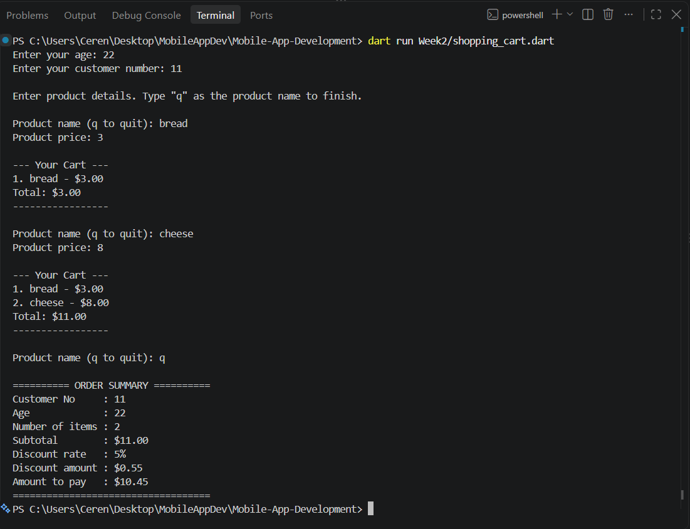

# 🛒 Shopping Cart Application

A console-based shopping cart application written in **Dart** for the Mobile App Development course. The program asks for the user's age and customer number, lets the user add products until they type `q`, and applies an age-based discount to the final total.

---

## 📋 Assignment Overview

This project demonstrates three core programming concepts:

1. **Variables and decision structures** (`if-else`)
2. **Loops** (`while`)
3. **Object-Oriented Programming** (classes and methods)

---

## 🖥️ Sample Output

---

## ✨ Features

- Stores the user's **age**, **customer number**, and **total amount** in variables
- Applies an **age-based discount** using an `if-else` structure
- Lets the user add **multiple products** (name and price) inside a `while` loop
- Stops when the user types **`q`**
- **Updates the total automatically** after each product is added
- **Displays all products** added so far after every addition
- Validates input (invalid age, customer number, or price will not crash the program)

---

## 🏷️ Discount Rules

| Age Group | Discount |
|-----------|----------|
| Under 18 | 10% |
| 18 – 60 (inclusive) | 5% |
| Over 60 | 15% |

---

## 🧱 Class Design

### `Product`

Represents a single item in the cart.

| Property | Type | Description |
|----------|------|-------------|
| `name` | `String` | Name of the product |
| `price` | `double` | Price of the product |

### `ShoppingCart`

Manages the products and the total price.

| Member | Type | Description |
|--------|------|-------------|
| `products` | `List<Product>` | List of products in the cart |
| `totalPrice` | `double` | Total price of all products |
| `addProduct(Product product)` | method | Adds a product and updates the total |
| `calculateTotal()` | method | Calculates and returns the total price |
| `showProducts()` | method | Prints all products in the cart as a list |

---

## ⚙️ How It Works

1. The program asks for the **age** and **customer number**.
2. A `while` loop starts asking for a **product name** and **price**.
3. Each product is added through `ShoppingCart.addProduct()`.
4. The total is recalculated with `ShoppingCart.calculateTotal()` and the full cart is displayed.
5. When the user types **`q`**, the loop ends.
6. The discount is chosen with `if-else` based on the user's age.
7. An **order summary** shows the subtotal, discount, and final amount to pay.

---

