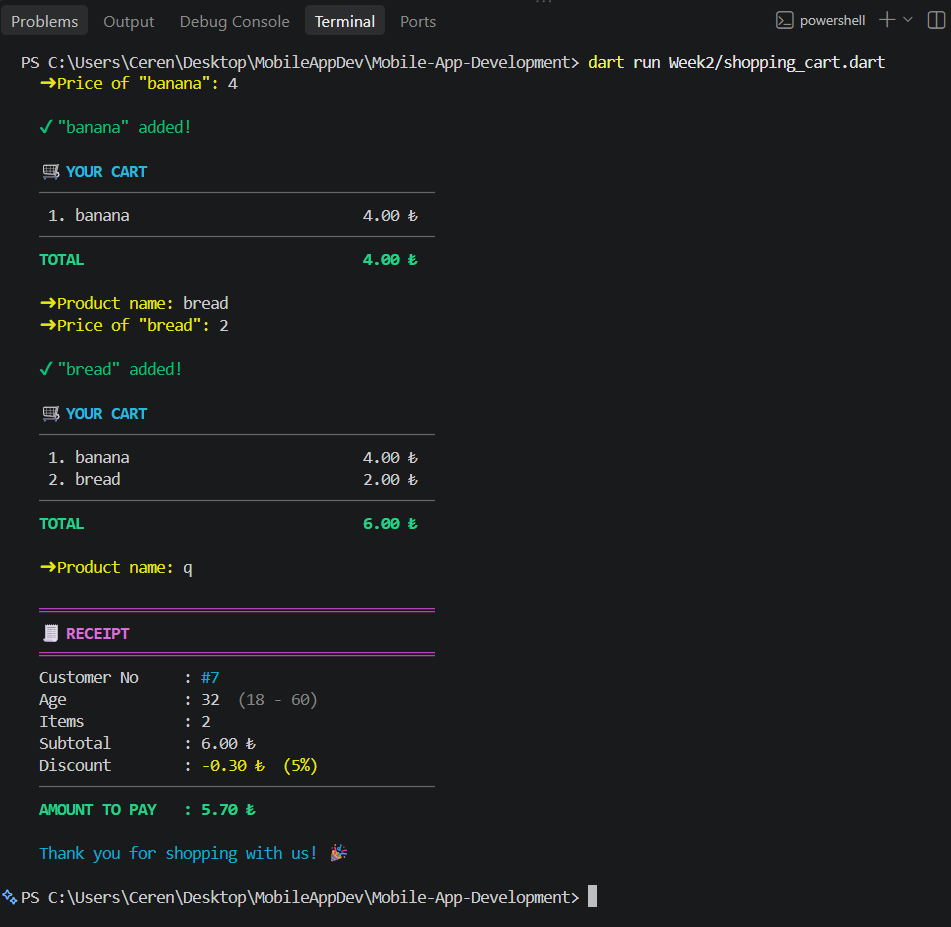

# 🛒 Simple Shopping Cart Application

A colorful, interactive console application written in **Dart**. It demonstrates **variables**, **if-else decisions**, **while loops**, and **object-oriented programming** (classes, methods, encapsulation).

---

## 🎯 What the App Does

1. Asks for the customer's **age** and **customer number**.
2. Lets the user add products (name + price) in a **while loop**.
3. After every product, shows **all products added so far** and the updated **total**.
4. The loop ends when the user types **`q`** as the product name.
5. Applies an **age-based discount** and prints a final receipt.

---

## 🖥️ Sample Run



---


## 1️⃣ Variables & Decision Structure

Three variables store the customer data:

| Variable | Type | Meaning |
|----------|------|---------|
| `age` | `int` | Customer's age |
| `customerNumber` | `int` | Customer's ID number |
| `totalAmount` | `double` | Total shopping amount |

Discount rules (`if - else if - else`):

| Age | Discount |
|-----|:--------:|
| Under 18 | **10%** |
| 18 – 60 | **5%** |
| Over 60 | **15%** |

```dart
if (age < 18) {
  discountRate = 0.10;
} else if (age <= 60) {
  discountRate = 0.05;
} else {
  discountRate = 0.15;
}
```

---

## 2️⃣ Loop

A `while (true)` loop keeps asking for products until the user enters `q`:

```dart
while (true) {
  final name = ask('Product name:');
  if (name.toLowerCase() == 'q') break;
  ...
  cart.addProduct(Product(name, price));
  totalAmount = cart.calculateTotal();
  printCart(cart); // shows the whole list after every addition
}
```

Input is validated: empty names, non-numeric prices, and prices ≤ 0 are rejected. Prices can be typed as `12.5` or `12,5`.

---

## 3️⃣ Object-Oriented Programming

### `Product`

| Member | Description |
|--------|-------------|
| `_name` (private) | Product name |
| `_price` (private) | Product price |
| `name`, `price` | Read-only getters |

### `ShoppingCart`

| Member | Description |
|--------|-------------|
| `_products` (private) | List of `Product` objects |
| `_totalPrice` (private) | Total price of the cart |
| `addProduct(Product)` | Adds a product and refreshes the total |
| `calculateTotal()` | Sums all product prices and returns the total |
| `products`, `totalPrice`, `isEmpty` | Read-only getters |

**Encapsulation:** the fields are private, and `products` is returned as `List.unmodifiable(...)`, so the list can only be changed through `addProduct()`.

---