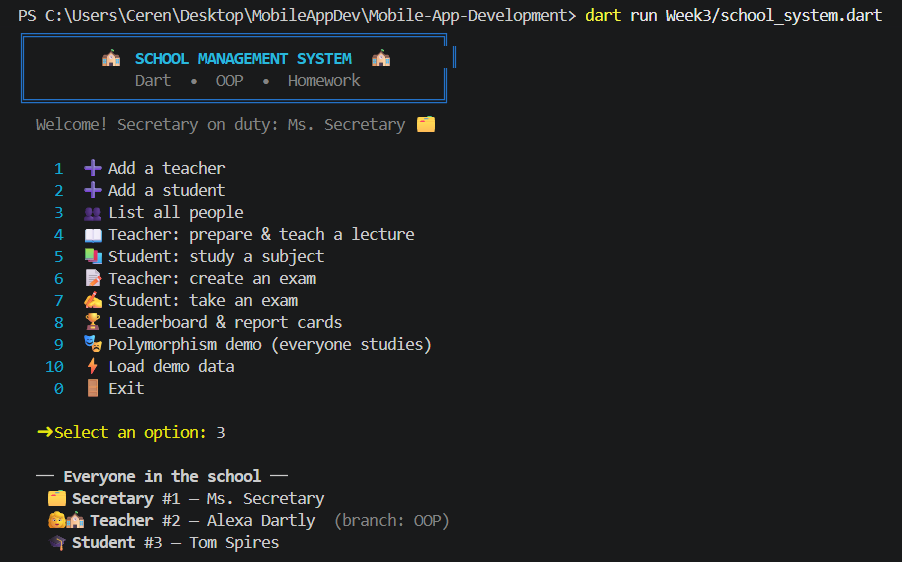
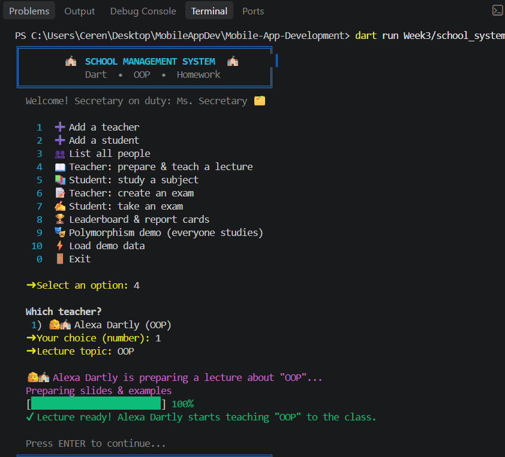
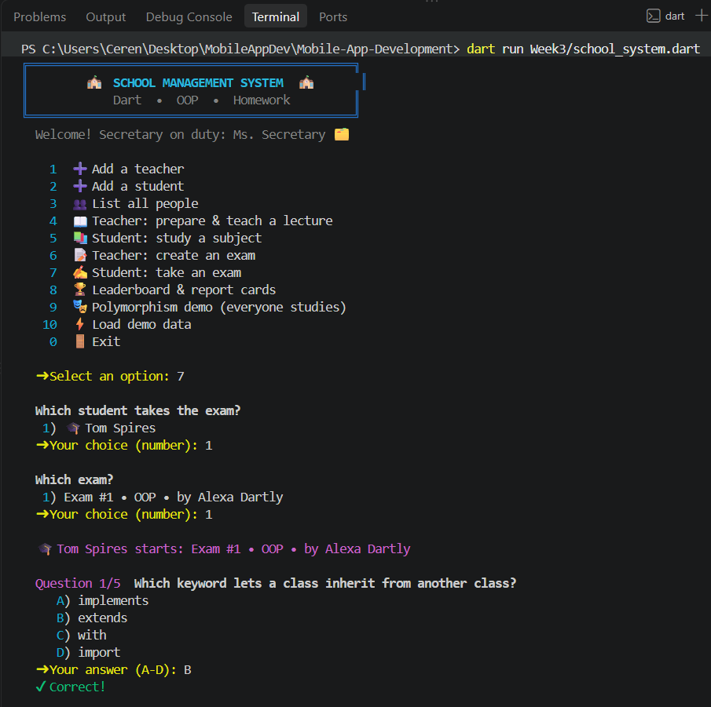

# 🏫 School Management System

An interactive, colorful console application written in **Dart** that demonstrates the core principles of **Object-Oriented Programming**: functions, classes, inheritance, polymorphism, and encapsulation (plus abstraction).

A **Secretary** registers teachers and students, **Teachers** prepare lectures and create exams, and **Students** study and take interactive exams that are graded instantly.

---

## 📋 Table of Contents

1. [Features](#-features)
2. [Getting Started](#-getting-started)
3. [How to Use](#-how-to-use)
4. [Class Design](#-class-design)
5. [OOP Concepts in the Code](#-oop-concepts-in-the-code)
6. [Grading Rules](#-grading-rules)
7. [Project Structure](#-project-structure)

---

## 🖥️ Sample Run




---

## ✨ Features

- 🗂️ **Secretary** adds teachers and students to the school
- 👩‍🏫 **Teachers** study (prepare a lecture to teach) and give exams
- 🎓 **Students** study subjects and take exams
- 📝 Interactive multiple-choice exams with instant feedback
- 🏆 Leaderboard with bar charts and per-student report cards
- 🎭 A polymorphism demo where every person "studies" in their own way
- 🎨 Colored output, emojis, a boxed banner, and animated progress bars


---

## 🕹️ How to Use

The app shows a menu. Type a number and press **ENTER**.

| Option | Action | Who performs it |
|:------:|--------|-----------------|
| `1` | Add a teacher (choose a branch: Dart or OOP) | Secretary |
| `2` | Add a student | Secretary |
| `3` | List all people in the school | — |
| `4` | Prepare and teach a lecture | Teacher |
| `5` | Study a subject | Student |
| `6` | Create an exam from the teacher's branch | Teacher |
| `7` | Take an exam (answer A–D) | Student |
| `8` | Show leaderboard and report cards | — |
| `9` | Polymorphism demo — everyone studies | All |
| `10` | Load demo data | — |
| `0` | Exit | — |

### Suggested walkthrough

1. `10` — load demo data
2. `4` — let a teacher prepare a lecture
3. `5` — let a student study (this earns bonus points!)
4. `6` — a teacher creates an exam
5. `7` — the student takes the exam
6. `8` — see the leaderboard
7. `9` — watch polymorphism in action

---

## 🧱 Class Design

```
                    ┌─────────────────────────┐
                    │   Person  (abstract)    │
                    │-------------------------│
                    │ - _name : String        │
                    │ + id : int              │
                    │ + name  (get / set)     │
                    │ + role, emoji (abstract)│
                    │ + study(topic) abstract │
                    └────────────┬────────────┘
             ┌───────────────────┼───────────────────┐
             ▼                   ▼                   ▼
   ┌───────────────────┐ ┌───────────────────┐ ┌───────────────────┐
   │     Secretary     │ │      Teacher      │ │      Student      │
   │-------------------│ │-------------------│ │-------------------│
   │ - _teachers       │ │ + branch          │ │ - _studySessions  │
   │ - _students       │ │ - _givenExams     │ │ - _results        │
   │ + addTeacher()    │ │ + study()         │ │ + study()         │
   │ + addStudent()    │ │ + giveExam()      │ │ + takeExam()      │
   │ + study()         │ │                   │ │ + average         │
   └───────────────────┘ └─────────┬─────────┘ └─────────┬─────────┘
                                   │ creates             │ produces
                                   ▼                     ▼
                         ┌───────────────────┐  ┌───────────────────┐
                         │       Exam        │◄─│    ExamResult     │
                         │-------------------│  │-------------------│
                         │ subject, teacher  │  │ correct, total    │
                         │ questions, results│  │ bonus, score      │
                         └─────────┬─────────┘  │ grade             │
                                   │ uses       └───────────────────┘
                                   ▼
                         ┌───────────────────┐
                         │ Question /        │
                         │ QuestionBank      │
                         └───────────────────┘
```

### Supporting classes

| Class | Purpose |
|-------|---------|
| `Ui` | Static helpers for colors, banner, input, pickers, and progress bars |
| `Question` | A single multiple-choice question with its correct answer index |
| `QuestionBank` | Stores questions per branch and returns a shuffled copy |
| `Exam` | An exam created by a teacher; collects all `ExamResult`s |
| `ExamResult` | Stores one student's result and calculates score and grade |

---

## 🎓 OOP Concepts in the Code

### 1. Classes & Objects
Every real-world entity is modeled as a class: `Person`, `Secretary`, `Teacher`, `Student`, `Exam`, `ExamResult`, `Question`.

### 2. Inheritance
`Secretary`, `Teacher`, and `Student` all **extend** the abstract `Person` class and reuse its `id`, `name`, `describe()`, and `toString()`.

```dart
class Teacher extends Person {
  final String branch;
  Teacher(super.name, this.branch);
}
```

### 3. Polymorphism
`study()` is declared once in `Person` and **overridden** differently in each subclass:

| Class | What `study()` does |
|-------|---------------------|
| `Teacher` | Prepares slides and starts teaching the lecture |
| `Student` | Reads notes, solves examples, and gains exam bonus points |
| `Secretary` | Organizes and archives documents |

The demo (menu option `9`) calls the same method on a `List<Person>`, and Dart picks the right implementation at runtime (dynamic dispatch):

```dart
for (final Person p in secretary.everyone) {
  p.study('Dart'); // different behavior for each object
}
```

### 4. Encapsulation
Internal data is **private** (prefixed with `_`) and exposed only through controlled getters/setters:

```dart
String _name = '';
String get name => _name;

set name(String value) {
  if (value.trim().length < 2) {
    throw ArgumentError('Name must have at least 2 characters.');
  }
  _name = value.trim();
}
```

Lists such as `_teachers`, `_students`, and `_givenExams` are returned as `List.unmodifiable(...)`, so outside code cannot modify them directly.

### 5. Abstraction
`Person` is an `abstract` class and cannot be instantiated. It forces subclasses to implement `study()`, `role`, and `emoji`.

### 6. Functions
Menu behavior is split into small, focused top-level functions such as `addTeacherAction()`, `takeExamAction()`, `leaderboardAction()`, and `polymorphismDemo()`. Generic functions like `Ui.pick<T>()` are reused for choosing teachers, students, exams, and subjects.

---

## 🧮 Grading Rules

```
score = round(correct / total × 90) + study bonus     (max 100)
```

- **Study bonus:** each study session in a subject gives **+2** points for exams in that subject, up to **+10**.
- A student **cannot retake** the same exam.

| Score | Grade |
|:-----:|:-----:|
| 90–100 | **A** |
| 80–89 | **B** |
| 70–79 | **C** |
| 60–69 | **D** |
| below 60 | **F** |

---

Made with ❤️ and Dart 🎯