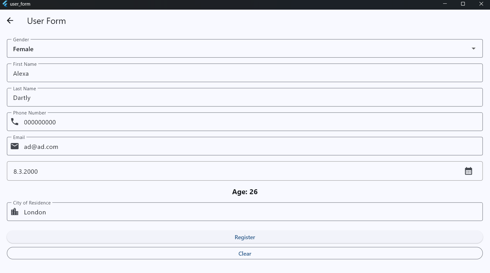

# 📝 User Form App

> **Week 4 · Mobile App Development**
> A two-page Flutter app: a welcome screen, a registration form with automatic age calculation, and a success popup.

---

## ✨ Overview

The app starts on a simple **"Hello World"** home page. From there, the user opens a **registration form** and fills in their personal details. The age is calculated automatically from the selected birth date, and a confirmation popup summarizes the registration.

---

## Sample



---

## 🧭 App Flow

```
┌──────────────┐   button   ┌──────────────────┐   Register   ┌────────────────┐
│  Home Page   │ ─────────▶ │    Form Page     │ ───────────▶ │  Success Popup │
│ "Hello World"│            │ details + age    │              │  (AlertDialog) │
└──────────────┘            └──────────────────┘              └───────┬────────┘
        ▲                                                             │ OK
        └─────────────────────────────────────────────────────────────┘
                              returns to Home Page
```

---

## 🚀 Features

| Feature | Description |
|---|---|
| 🏠 **Home page** | Shows "Hello World" and a button that navigates to the form |
| 👤 **Personal details** | First name, last name, gender, city of residence |
| 📞 **Contact details** | Phone number and email, both validated |
| 🎂 **Birth date picker** | Calendar dialog with a 1900 – today range |
| 🔢 **Automatic age** | Age is calculated instantly when a date is picked |
| ✅ **Validation** | A `SnackBar` warns about empty or invalid fields |
| 🎉 **Success popup** | `AlertDialog` showing the registered user's name, age and details |
| 🧹 **Clear button** | Resets every field in one tap |
| 🔙 **Auto return** | Goes back to the home page after the popup is closed |

---

## 📋 Form Fields

| Field | Input type | Rules |
|---|---|---|
| Gender | Dropdown | Male, Female, Prefer not to say |
| First Name | Text | Required |
| Last Name | Text | Required |
| Phone Number | Phone keyboard | Required, 10–15 digits |
| Email | Email keyboard | Required, must look like `name@domain.com` |
| Birth Date | Date picker | Required |
| Age | Read-only | Calculated from birth date |
| City | Text | Required |

---

## 🎂 How Age Is Calculated

The year difference is taken first. If this year's birthday has not happened yet, one year is subtracted.

```dart
int calculateAge(DateTime birth) {
  final DateTime today = DateTime.now();
  int calculatedAge = today.year - birth.year;

  if (today.month < birth.month ||
      (today.month == birth.month && today.day < birth.day)) {
    calculatedAge--;
  }
  return calculatedAge;
}
```

**Example:** born `10.05.2000`, today `07.10.2026` → `2026 - 2000 = 26` → birthday already passed → **26**.

---

## 🗂️ Project Structure

```
user_form/
├── lib/
│   ├── main.dart          # Entry point, MyApp, HomePage (page 1)
│   └── form_page.dart     # FormPage (page 2)
├── test/
│   └── widget_test.dart   # Widget tests
├── pubspec.yaml           # Dependencies and metadata
└── analysis_options.yaml  # Lint rules
```

---

## 🧠 Concepts Used

| Concept | Purpose |
|---|---|
| `MaterialApp` | App root: theme, title and home page |
| `StatelessWidget` | Home page, which never changes |
| `StatefulWidget` + `setState` | Form page, where values change over time |
| `Navigator.push` / `pop` | Moving between pages |
| `TextEditingController` | Reading and clearing text fields |
| `DropdownButtonFormField` | Gender selection |
| `showDatePicker` | Birth date selection |
| `showDialog` + `AlertDialog` | Success popup |
| `ScaffoldMessenger` + `SnackBar` | Validation warnings |
| `RegExp` | Email and phone format checks |


---

## 📚 Assignment Checklist

- [x] Phone number field
- [x] Email field
- [x] "Prefer not to say" gender option
- [x] User's name and age in the success popup
- [x] "Clear" button that resets the form
- [x] Return to the home page after a successful registration